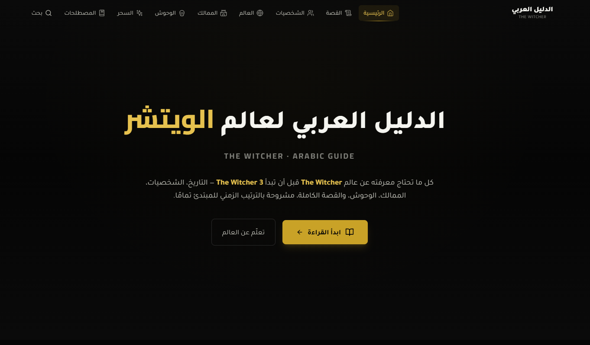

# The Witcher — Arabic Guide

A simple, clean guide website translating The Witcher content to Arabic.

Live demo: (add your URL here)

## Features
- Clean, responsive site
- Arabic translations of guides and tips
- Easy to navigate sections

## Screenshot
A hero screenshot is included below. File path: `assets/screenshots/hero.png`.



If you'd like a second (mobile) screenshot, add `assets/screenshots/mobile.png` and I'll update the README to show it.

## Getting started
1. Clone the repo
   ```bash
   git clone https://github.com/Klobay/The-Witcher-Arabic-Guide.git
   ```
2. Open the site files or run the dev server (project-specific instructions go here).

## Contributing
Small, focused PRs welcome. Keep translations in `content/` and screenshots in `assets/screenshots/`.

## License
MIT — see LICENSE file.

---

If you want, provide the actual images and a demo URL and this README will be updated to include them.
